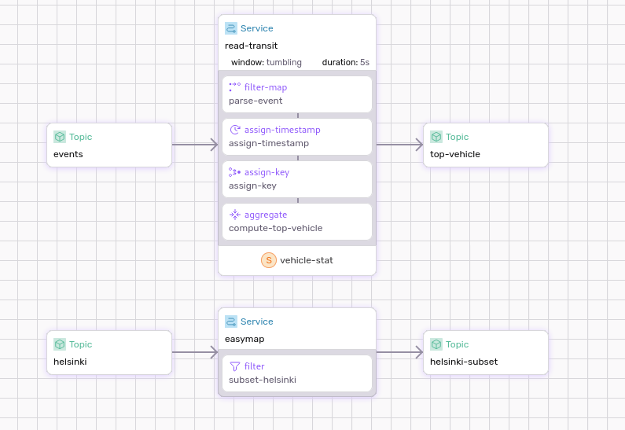

# Demo of SSDK with helsinki metro MQTT
A dataflow example that incorporates live data from helsinki found on digitransit [link](https://digitransit.fi/en/developers/apis/4-realtime-api/vehicle-positions/high-frequency-positioning/#event-types) using connectors as well transformations with SDF. A live demo via express and react is also included.



## Dataflow Primitives

 - *filter*
 - *filter-map*
 - *flat-map*
 - *assign-timestamp*
 - *update-state*
 - *arrow-row keyed-states*
 - *sql*

There is a demonstration of the utilizing sql queries to select the collected data of a tumbling window.

## Steps to Run
### Download Jolt SmartModule
```
$ fluvio hub smartmodule download infinyon/jolt@0.4.1
```
## Start local connector
To start a local instance of the connector. 
```
cd connector
cdk hub download infinyon/mqtt-source@0.2.8
cdk deploy start --ipkg infinyon-mqtt-source-0.2.8.ipkg --config mqtt-helsinki.yaml
```

You should see the following output:

```
$ fluvio consume helsinki | jq

{
  "vehicle": 456,
  "tst": "2024-03-19T02:28:08.028Z",
  "speed": 3.96,
  "lat": 60.197156,
  "long": 24.718909,
  "route": "2235N"
}
{
  "vehicle": 1423,
  "tst": "2024-03-19T02:28:08.149Z",
  "speed": 0,
  "lat": 60.20017,
  "long": 24.685558,
  "route": "2134N"
}
{
  "vehicle": 1828,
  "tst": "2024-03-19T02:28:08.181Z",
  "speed": 0.15,
  "lat": 60.178577,
  "long": 24.950038,
  "route": "4600"
}

```
## Start Dataflow with SDF

Run ```sdf run```

_Note: if there are errors with workers/topics not found you run with_ ```sdf run --ephemeral```

Read top 5 bus speed:
```
$ fluvio consume top-vehicle | jq
```
Example output:
```
[
  {
    "speed": 23.5090625,
    "vehicle": "1827"
  },
  {
    "speed": 21.8603125,
    "vehicle": "1042"
  },
  {
    "speed": 21.7384375,
    "vehicle": "1145"
  },
  {
    "speed": 21.685312500000002,
    "vehicle": "164"
  },
  {
    "speed": 21.1765625,
    "vehicle": "1128"
  }
]
```

## Shutdown the local connector
Run ``` cdk deploy shutdown --name helsinki-mqtt ``` to delete the old connector
Run ```sdf clean ``` to clean

## To Run the Visual Demo
### Start Websocket via Express
Navigate to websocket and run node
```
cd helsinki-express-websocket
npm install
node app.js
```
Make sure to ensure port 3000 is open.
### Run react frontend
Navigate to the frontend folder and serve the frontend
```
cd helsinki-frontend
npm install
npm install -g serve
serve -s build/
```
Make sure port the site is running on anything but port 3000.

